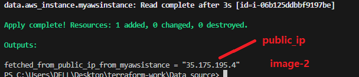
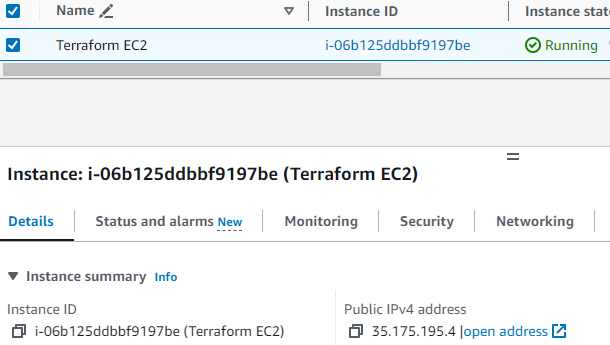
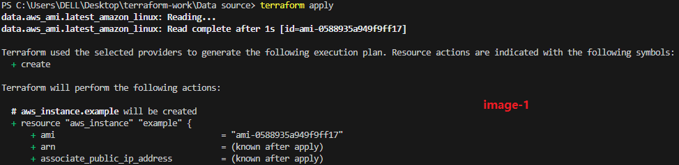
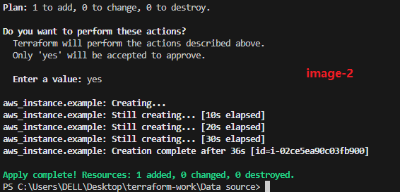
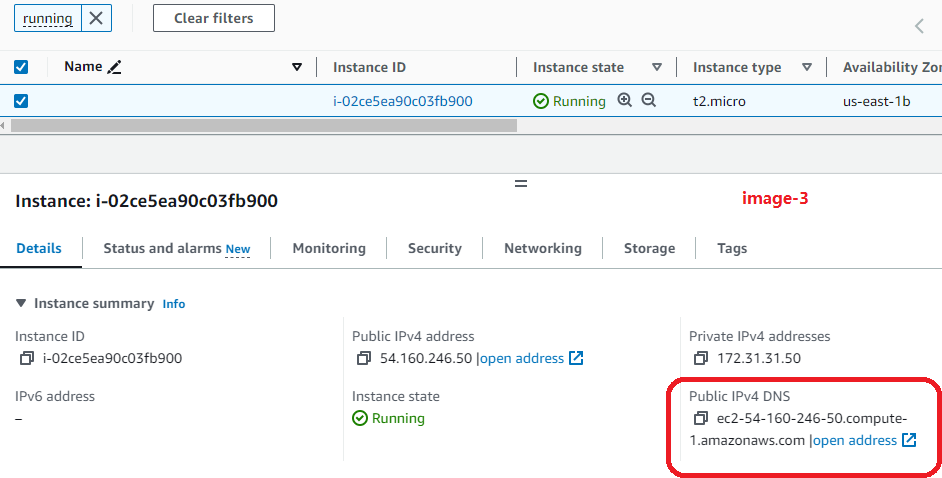

# Terraform Datasources
- Terraform Datasource it is way of fetch and use existing information or resources from the infrastrucher that we are actually managing 
- it will allow to query the external systems (like cloud providers API databases etc... ad use the obtained data wothin our terraform configuration file )
- we can fetch the data on the providers and use inside terraform file and fetch the data from resource block and providers 

# Basic Syntax of Datasource

		data "aws_ami" "latest_amazon_linux" {
		  most_recent = true
		  owners      = ["amazon"]

		  filter {
			name   = "name"
			values = ["amzn2-ami-hvm-*-x86_64-gp2"]
		  }
		}

		resource "aws_instance" "example" {
		  ami           = data.aws_ami.latest_amazon_linux.id
		  instance_type = "t2.micro"

		  # other instance configurations...
		}

- From above syntax data block search for amazon linux machine which is latest amazon linux machine
- From above resource block we are using that latest amazon linux machine inside resource block to launch and instance 

- The aws_ami data source queries AWS to find the latest Amazon Linux AMI.
- The resulting AMI information is stored in the data.aws_ami.latest_amazon_linux variable.
- The aws_instance resource then uses the AMI ID obtained from the data source to launch an EC2 instance.  

# Terraform output values

-> using terraform output values we able to print that information on terminal in a flexible way 

        data "aws_instance" "myawsinstance" {
            filter {
            name = "tag:Name"
            values = ["Terraform EC2"]
            }

            depends_on = [
            "aws_instance.ec2_example"
            ]
        } 
                
        output "fetched_info_from_aws" {
            value = data.aws_instance.myawsinstance
        }

- From above basic terraform code in the data source block defining instance to pick and hold on perticular data.aws_instance.myinstance 
- Excute and print those instance information at the time of output block ( suppose like if we reqired public_ip or any image information )

- For to print image public ip 

		output "fetched_info_from_aws" {
			value = data.aws_instance.myawsinstance.public_ip
		}

- from above file it will print public ip of that perticular myawsinstance 

>> Note: Both data sources and output values contribute to the flexibility and reusability of Terraform configurations. Data sources enable you to dynamically fetch information during the planning and provisioning phases, while output values allow you to expose relevant information for further consumption or integration with other systems.

# Implementation 

		provider "aws" {
			region = "us-east-1"
		}

		resource "aws_instance" "myec2" {
			ami           = "ami-0fc5d935ebf8bc3bc"
			instance_type = "t2.micro"

			tags = {
				Name = "Terraform EC2"
			}
		}

		data "aws_instance" "myawsinstance" {
			filter {
				name   = "tag:Name"
				values = ["Terraform EC2"]
			}

			depends_on = [
				"aws_instance.myec2"
				]
			}

			output "fetched_from_public_ip_from_myawsistance" {
				value = data.aws_instance.myawsinstance.public_ip
		}

# Launch an amazon instance 
- below scenario is like launch an instance which is latest one that should amazon only 

		provider "aws" {
			region = "us-east-1"
		}

		data "aws_ami" "latest_amazon_linux" {
			most_recent = true
			owners      = ["amazon"]

			filter {
				name   = "name"
				values = ["amzn2-ami-hvm-*-x86_64-gp2"]
			}
		}
		resource "aws_instance" "example" {
			ami           = data.aws_ami.latest_amazon_linux.id
			instance_type = "t2.micro"

			# other instance configurations...
		}

