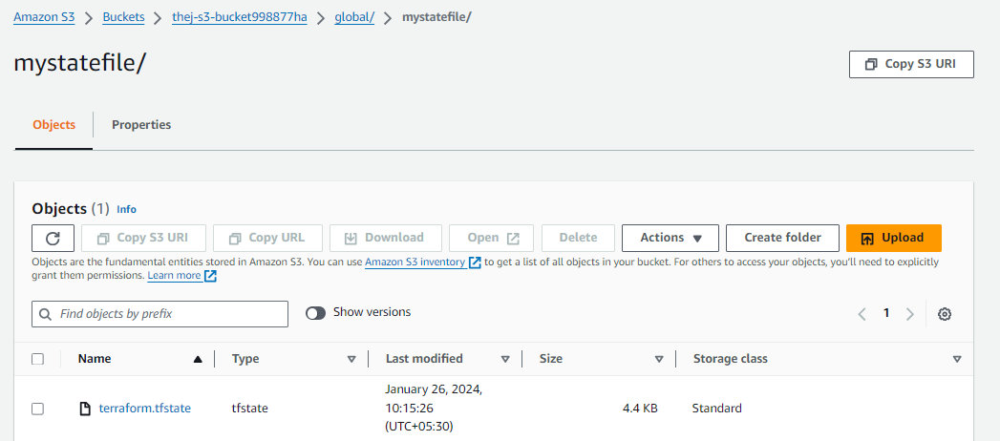
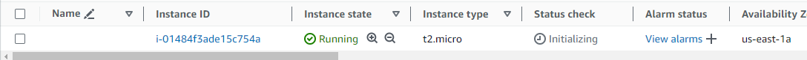
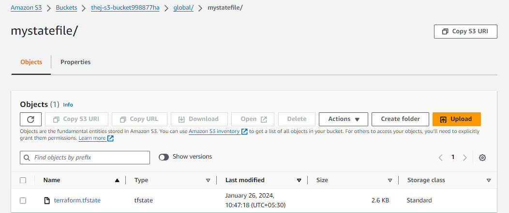

Terraform state file Lockig 
------------------------------
- Store terraform.tfstate file using S3 bucket and DynamoDB From Local machine to Remote S3 bucket 
 - s3 bucket it used to store or maintain state file remotely on aws
 - DynamoDB is used for Lock state file in S3 bucket  to prevent accidental changes 

state file
----------
- state file maintain actual existing resource infrastrucher information  which is generated by main terraform file 
- To maintain state file is very important 
- some scenarios where in a project there are multiple developers need to work on single terraform file so everytime developers working on single terraform file make changes some times 
- so we need to  setup Lock protection to state file
- This Lock setup implemented in aws using DynamoDB along with S3 bucket for storing terraform remote state file 

state Locking Benifits
-----------------------
- work with multiple persones on single terraform script 
- state lockig prevents accidental corruption of state
- version
- Encryption

Pre-Requiset
------------
1. create S3 bucket (manualyy or automatically using using backend.tf file (automatically is recomented))
2. create DynamoDB (manualyy or automatically using using backend.tf file (automatically is recomented))

# To create s3 bucket and DynamoDB using backed.tf file first 

        # s3 creation

        resource "aws_s3_bucket" "mybucket" {
            bucket = "thej-s3-bucket998877ha"
            versioning {
                enabled = true
            }
                server_side_encryption_configuration {
                rule {
                    apply_server_side_encryption_by_default {
                    sse_algorithm = "AES256"
                    }
                }
                }
            }

            # DynamoDb creation

            resource "aws_dynamodb_table" "statelock" {
            name = "state-lock"
            billing_mode = "PAY_PER_REQUEST"
            hash_key = "LockID"

            attribute {
                name = "LockID"
                type = "S"
            }
        }

> from above file perform terraform init and terraform plan and terraform apply then first those will be created s3 bucket and DynamoDB here 

Setup state LockID using DynamoDB
----------------------------------
- After complete of creation s3 bucket and dynamodb table Now implement state Lock 
- Now add terraform block in main.tf file with credentials which is (profile = admin -> here admin is a IAM username )

        terraform {
            backend "s3" {
                bucket         = "thej-s3-bucket998877ha"
                dynamodb_table = "state-lock"
                key            = "global/mystatefile/terraform.tfstate"
                region         = "us-east-1"
                encrypt        = true
                profile = "admin"
            }
        }

> above terraform block add after creating s3 and dynamodb table 

- Now perform command again terraform init and terraform plan and apply 

        DELL@Navathej MINGW64 ~/Desktop/Terraform State Locking Using Dynamodb
        $ terraform apply 
        Acquiring state lock. This may take a few moments...
        aws_dynamodb_table.statelock: Refreshing state... [id=state-lock]
        aws_s3_bucket.mybucket: Refreshing state... [id=thej-s3-bucket998877ha]

        No changes. Your infrastructure matches the configuration.

        Terraform has compared your real infrastructure against your configuration and found no differences, so no changes are
        needed.
        ╷
        │ Warning: Argument is deprecated
        │
        │   with aws_s3_bucket.mybucket,
        │   on backend.tf line 1, in resource "aws_s3_bucket" "mybucket":
        │    1: resource "aws_s3_bucket" "mybucket" {
        │
        │ Use the aws_s3_bucket_server_side_encryption_configuration resource instead
        │
        │ (and 3 more similar warnings elsewhere)
        ╵
        Releasing state lock. This may take a few moments...

        Apply complete! Resources: 0 added, 0 changed, 0 destroyed.

        DELL@Navathej MINGW64 ~/Desktop/Terraform State Locking Using Dynamodb
    
>> observe above output when i run terraform apply command it hold it into Lock state file after complete it will release Release Lock 

Practicles
-------------
- Here i launch a machine using below code 

        resource "aws_instance" "myec2" {
            ami = "ami-0a3c3a20c09d6f377"
            instance_type = "t2.micro"
        }

- Now i perform terraform plan and apply 

        DELL@Navathej MINGW64 ~/Desktop/Terraform State Locking Using Dynamodb
        $ terraform apply 
        Acquiring state lock. This may take a few moments...
        aws_dynamodb_table.statelock: Refreshing state... [id=state-lock]
        aws_s3_bucket.mybucket: Refreshing state... [id=thej-s3-bucket998877ha]

        Terraform used the selected providers to generate the following execution plan. Resource actions are indicated with the
        following symbols:
        + create

        Terraform will perform the following actions:

        # aws_instance.myec2 will be created
        + resource "aws_instance" "myec2" {
            + ami                                  = "ami-0a3c3a20c09d6f377"
            + arn                                  = (known after apply)    
            + associate_public_ip_address          = (known after apply)    
            + availability_zone                    = (known after apply)    
            + cpu_core_count                       = (known after apply)    
            + cpu_threads_per_core                 = (known after apply)    
            + disable_api_stop                     = (known after apply)    
            + disable_api_termination              = (known after apply)    
            + ebs_optimized                        = (known after apply)    
            + get_password_data                    = false
            + host_id                              = (known after apply)    
            + host_resource_group_arn              = (known after apply)
            + iam_instance_profile                 = (known after apply)
            + id                                   = (known after apply)
            + instance_initiated_shutdown_behavior = (known after apply)
            + instance_lifecycle                   = (known after apply)
            + instance_state                       = (known after apply)
            + instance_type                        = "t2.micro"
            + ipv6_address_count                   = (known after apply)
            + ipv6_addresses                       = (known after apply)
            + key_name                             = (known after apply)
            + monitoring                           = (known after apply)
            + outpost_arn                          = (known after apply)
            + password_data                        = (known after apply)
            + placement_group                      = (known after apply)
            + placement_partition_number           = (known after apply)
            + primary_network_interface_id         = (known after apply)
            + private_dns                          = (known after apply)
            + private_ip                           = (known after apply)
            + public_dns                           = (known after apply)
            + public_ip                            = (known after apply)
            + secondary_private_ips                = (known after apply)
            + security_groups                      = (known after apply)
            + source_dest_check                    = true
            + spot_instance_request_id             = (known after apply)
            + subnet_id                            = (known after apply)
            + tags_all                             = (known after apply)
            + tenancy                              = (known after apply)
            + user_data                            = (known after apply)
            + user_data_base64                     = (known after apply)
            + user_data_replace_on_change          = false
            + vpc_security_group_ids               = (known after apply)
            }

        Plan: 1 to add, 0 to change, 0 to destroy.
        ╷
        │ Warning: Argument is deprecated
        │
        │   with aws_s3_bucket.mybucket,
        │   on backend.tf line 1, in resource "aws_s3_bucket" "mybucket":
        │    1: resource "aws_s3_bucket" "mybucket" {
        │
        │ Use the aws_s3_bucket_server_side_encryption_configuration resource instead
        │
        │ (and 3 more similar warnings elsewhere)
        ╵

        Do you want to perform these actions?
        Terraform will perform the actions described above.
        Only 'yes' will be accepted to approve.

        Enter a value: yes

        aws_instance.myec2: Creating...
        aws_instance.myec2: Still creating... [10s elapsed]
        aws_instance.myec2: Still creating... [20s elapsed]
        aws_instance.myec2: Still creating... [30s elapsed]
        aws_instance.myec2: Creation complete after 36s [id=i-01484f3ade15c754a]
        Releasing state lock. This may take a few moments...

        Apply complete! Resources: 1 added, 0 changed, 0 destroyed.

        DELL@Navathej MINGW64 ~/Desktop/Terraform State Locking Using Dynamodb

> from above output a machine created 

- But when i try to destroy infrastrucher it is deleting ec2 machine got deleted but s3 bucket cant be delete 

        DELL@Navathej MINGW64 ~/Desktop/Terraform State Locking Using Dynamodb
        $ terraform destroy
        Acquiring state lock. This may take a few moments...
        aws_dynamodb_table.statelock: Refreshing state... [id=state-lock]
        aws_s3_bucket.mybucket: Refreshing state... [id=thej-s3-bucket998877ha]
        aws_instance.myec2: Refreshing state... [id=i-01484f3ade15c754a]       

        Terraform used the selected providers to generate the following execution plan. Resource actions are indicated with the
        following symbols:
        - destroy

        Terraform will perform the following actions:

        # aws_dynamodb_table.statelock will be destroyed
        - resource "aws_dynamodb_table" "statelock" {
            - arn                         = "arn:aws:dynamodb:us-east-1:115498080659:table/state-lock" -> null
            - billing_mode                = "PAY_PER_REQUEST" -> null
            - deletion_protection_enabled = false -> null
            - hash_key                    = "LockID" -> null
            - id                          = "state-lock" -> null
            - name                        = "state-lock" -> null
            - read_capacity               = 0 -> null
            - stream_enabled              = false -> null
            - table_class                 = "STANDARD" -> null
            - tags                        = {} -> null
            - tags_all                    = {} -> null
            - write_capacity              = 0 -> null

            - attribute {
                - name = "LockID" -> null
                - type = "S" -> null
                }

            - point_in_time_recovery {
                - enabled = false -> null
                }

            - ttl {
                - enabled = false -> null
                }
            }

        # aws_instance.myec2 will be destroyed
        - resource "aws_instance" "myec2" {
            - ami                                  = "ami-0a3c3a20c09d6f377" -> null
            - arn                                  = "arn:aws:ec2:us-east-1:115498080659:instance/i-01484f3ade15c754a" -> null    
            - associate_public_ip_address          = true -> null
            - availability_zone                    = "us-east-1a" -> null
            - cpu_core_count                       = 1 -> null
            - cpu_threads_per_core                 = 1 -> null
            - disable_api_stop                     = false -> null
            - disable_api_termination              = false -> null
            - ebs_optimized                        = false -> null
            - get_password_data                    = false -> null
            - hibernation                          = false -> null
            - id                                   = "i-01484f3ade15c754a" -> null
            - instance_initiated_shutdown_behavior = "stop" -> null
            - instance_state                       = "running" -> null
            - instance_type                        = "t2.micro" -> null
            - ipv6_address_count                   = 0 -> null
            - ipv6_addresses                       = [] -> null
            - monitoring                           = false -> null
            - placement_partition_number           = 0 -> null
            - primary_network_interface_id         = "eni-0b9972decb20f8d3f" -> null
            - private_dns                          = "ip-172-31-95-84.ec2.internal" -> null
            - private_ip                           = "172.31.95.84" -> null
            - public_dns                           = "ec2-54-224-237-101.compute-1.amazonaws.com" -> null
            - public_ip                            = "54.224.237.101" -> null
            - secondary_private_ips                = [] -> null
            - security_groups                      = [
                - "default",
                ] -> null
            - source_dest_check                    = true -> null
            - subnet_id                            = "subnet-010896a981e0edf84" -> null
            - tags                                 = {} -> null
            - tags_all                             = {} -> null
            - tenancy                              = "default" -> null
            - user_data_replace_on_change          = false -> null
            - vpc_security_group_ids               = [
                - "sg-0504913d3362de278",
                ] -> null

            - capacity_reservation_specification {
                - capacity_reservation_preference = "open" -> null
                }

            - cpu_options {
                - core_count       = 1 -> null
                - threads_per_core = 1 -> null
                }

            - credit_specification {
                - cpu_credits = "standard" -> null
                }

            - enclave_options {
                - enabled = false -> null
                }

            - maintenance_options {
                - auto_recovery = "default" -> null
                }

            - metadata_options {
                - http_endpoint               = "enabled" -> null
                - http_protocol_ipv6          = "disabled" -> null
                - http_put_response_hop_limit = 2 -> null
                - http_tokens                 = "required" -> null
                - instance_metadata_tags      = "disabled" -> null
                }

            - private_dns_name_options {
                - enable_resource_name_dns_a_record    = false -> null
                - enable_resource_name_dns_aaaa_record = false -> null
                - hostname_type                        = "ip-name" -> null
                }

            - root_block_device {
                - delete_on_termination = true -> null
                - device_name           = "/dev/xvda" -> null
                - encrypted             = false -> null
                - iops                  = 3000 -> null
                - tags                  = {} -> null
                - throughput            = 125 -> null
                - volume_id             = "vol-0a4669630e37d75cc" -> null
                - volume_size           = 8 -> null
                - volume_type           = "gp3" -> null
                }
            }

        # aws_s3_bucket.mybucket will be destroyed
        - resource "aws_s3_bucket" "mybucket" {
            - arn                         = "arn:aws:s3:::thej-s3-bucket998877ha" -> null
            - bucket                      = "thej-s3-bucket998877ha" -> null
            - bucket_domain_name          = "thej-s3-bucket998877ha.s3.amazonaws.com" -> null
            - bucket_regional_domain_name = "thej-s3-bucket998877ha.s3.us-east-1.amazonaws.com" -> null
            - force_destroy               = false -> null
            - hosted_zone_id              = "Z3AQBSTGFYJSTF" -> null
            - id                          = "thej-s3-bucket998877ha" -> null
            - object_lock_enabled         = false -> null
            - region                      = "us-east-1" -> null
            - request_payer               = "BucketOwner" -> null
            - tags                        = {} -> null
            - tags_all                    = {} -> null

            - grant {
                - id          = "8e3559eedf1e4f0c3dc64378de42190db32d03f4672d7209425a98e2d5853948" -> null
                - permissions = [
                    - "FULL_CONTROL",
                    ] -> null
                - type        = "CanonicalUser" -> null
                }

            - server_side_encryption_configuration {
                - rule {
                    - bucket_key_enabled = false -> null

                    - apply_server_side_encryption_by_default {
                        - sse_algorithm = "AES256" -> null
                        }
                    }
                }

            - versioning {
                - enabled    = true -> null
                - mfa_delete = false -> null
                }
            }

        Plan: 0 to add, 0 to change, 3 to destroy.
        ╷
        │ Warning: Argument is deprecated
        │
        │   with aws_s3_bucket.mybucket,
        │   on backend.tf line 1, in resource "aws_s3_bucket" "mybucket":
        │    1: resource "aws_s3_bucket" "mybucket" {
        │
        │ Use the aws_s3_bucket_versioning resource instead
        │
        │ (and one more similar warning elsewhere)
        ╵

        Do you really want to destroy all resources?
        Terraform will destroy all your managed infrastructure, as shown above.
        There is no undo. Only 'yes' will be accepted to confirm.

        Enter a value: yes

        aws_dynamodb_table.statelock: Destroying... [id=state-lock]
        aws_s3_bucket.mybucket: Destroying... [id=thej-s3-bucket998877ha]
        aws_instance.myec2: Destroying... [id=i-01484f3ade15c754a]
        aws_dynamodb_table.statelock: Destruction complete after 6s
        aws_instance.myec2: Still destroying... [id=i-01484f3ade15c754a, 10s elapsed]
        aws_instance.myec2: Still destroying... [id=i-01484f3ade15c754a, 20s elapsed]
        aws_instance.myec2: Still destroying... [id=i-01484f3ade15c754a, 30s elapsed]
        aws_instance.myec2: Still destroying... [id=i-01484f3ade15c754a, 40s elapsed]
        aws_instance.myec2: Destruction complete after 42s
        ╷

        │
        │
        ╵
        Releasing state lock. This may take a few moments...
        ╷
        │ Error: Error releasing the state lock
        │
        │ Error message: failed to retrieve lock info: ResourceNotFoundException: Requested resource not found
        │
        │ Terraform acquires a lock when accessing your state to prevent others
        │ running Terraform to potentially modify the state at the same time. An
        │ error occurred while releasing this lock. This could mean that the lock
        │ did or did not release properly. If the lock didn't release properly,
        │ Terraform may not be able to run future commands since it'll appear as if
        │ the lock is held.
        │
        │ In this scenario, please call the "force-unlock" command to unlock the
        │ state manually. This is a very dangerous operation since if it is done
        │ erroneously it could result in two people modifying state at the same time.
        │ Only call this command if you're certain that the unlock above failed and
        │ that no one else is holding a lock.
        ╵

        DELL@Navathej MINGW64 ~/Desktop/Terraform State Locking Using Dynamodb

- terminated system

- Bucket

