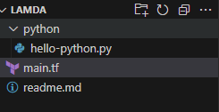
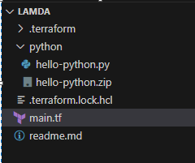
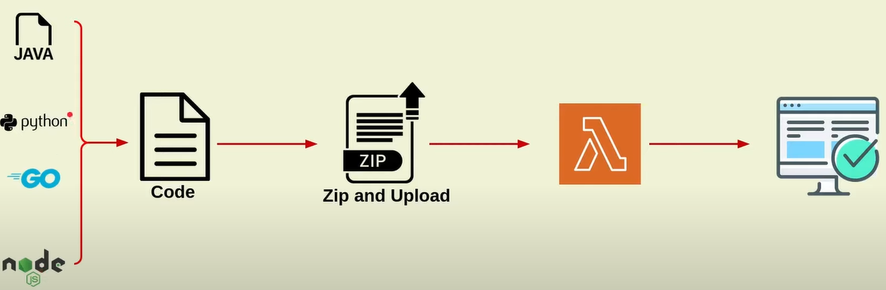
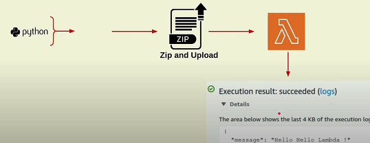
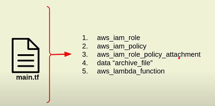

# Terraform aws Lambda
- Lambda:
	- aws lambda it is a server less compute service in aws 
	- it will allow and run code without having provision or manage servers explicitly 
	- using lambda service we only focus on writing Application code and aws takes care of everything like to setup infrastrucher and scaling automatically

- Terraform:
	- Here To create lamda function using To setup and deploy a pyhon code inside lambda 
	- first a folder inside terraform workspace provide already develop the code to deploy into lambda 
	- Before upload code into lambda terraform create a zip file for our code then it will deploy into lambda 

- Folder strucher of the terraform workspace 

- Folder strucher of the terraform workspace after terraform plan based on our main terraform file it will create zip file of our development python code   

- In this scenarion we are deploy python application code into lambda function using terraform 

- For any code follow below picture process 

 - first take code from developers 
 - write terraform code to zip application code 
 - write terrafrom code to deploy into lambda function 
 - Now make sure to test this working or not 

 - In order deploy code into lambda function create above steps for them write code inside main terraform file 

