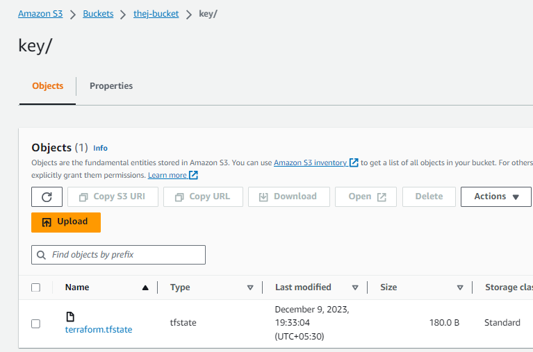

# Terraform state file 

- terraform state file containe current activity of main terraform configuration file 
- In terraform the state file is a crucial component that keeps track of the current state of infrastrucher 
- it is a JSON formatted file that containes information about the resources created by terraform their current configuration and other metadata
- the state file allow terraform to understand what resource it has provisioned and how they are configured, which is essential for operations like updates modifications and destruction.

1. cotent of the state file	
	- the state file containe detailed representation of the resources managed by terraform (includingtheir attributes, dependencies, and othr configuration details)
	- it is also used to track the metadata such as provider information, version of terraform used, and variuos settings 
	
2. Location of the state file 
	- By default terraform create local terraform.tfstate file in the same directory or folder based on our terraform configurations files
	- best practice to use terraform.tfstate file remotely like (amazon s3, and azure storage , hashicorp cosul) for collaborations of security and versio control of the file 

3. Purpose of the state file 
	- the terraform state file is critical to understand the existing infrastrucher and make decisions about how to modify it state file 
	- it helps what what resources are already available ad what resources need to create and what need to detroy for our desired terraform configuration file 

4. Cocurrency and Locking 
	- terraform employes a Locking mechanism when working with state file to prevent concurrent operations from modifying the state file simenteneously. this will help avoid conflicts and data consistency 

5. Remote state Backends
	- Remotes state file is recomended especially in team based environments 
	- To provide centralized shared location is important this will help team collaborations and version control of state file

6. Sensitive information
	- the state file containe sensitive information like Public ip and API keys and private ip 
	- it is crucial to handle state file 
	- maintaine secure storage options for state file 

7. Managing the state 
	- Terraform commands like terraform apply and terraform destroy and terraform import interact with state file is important To manage the state file properly 
	- To avoid accidental deletion and modifications 

8. Take care of state file to maintaine and excute any commands properly To avoid zccidental modifications and deleteion when perticularly using teams based environments 

>>saving state file Locally: whenever a single developer working with terraform workspace it is ok to store state file Locally 

>>state file stores Remote: whenever multiple team based evironments working with terraform workspace it is better save state file remotely like amazon s3 

# To store state file Remotely in Amazon S3 
	
- Basic syntax to use in main terraformfile 

        terraform {
            backend "s3" {
                bucket	= "thej-bucket"
                key		= "key/terraform.tfstate"
                region	= "us-east-1"
            }
        }
	
- from above cotent that already existing bucket inside that bucket a key folder is created under that folder terraform.tfstate file is created or maintained remotely 
	
# uses in mainmtf file 

		terraform {
			backend "s3" {
				bucket = "thej-bucket"
				key    = "key/terraform.tfstate"
				region = "us-east-1"
			}
		}
		provider "aws" {
			region = "us-east-1"
		}
		resource "aws_instance" "my-ec2" {
			ami           = "ami-0fc5d935ebf8bc3bc"
			instance_type = "t2.micro"
			tags = {
				Name = "my-instance"
			}
		}

