# Terraform workspace
- By help of this terraform workspace using single main.tf file used in differet workspace
- suppose i created dev-instances in developer workspace environmnet and later using that same main.tf file i switched to test workspace and using that main.tf file i created test-instances 
- using workspace concept we able to create multi environments using single main.tf file 
- terraform Workspace it is work like similar to git 
- like in git we are creating child branch and do work on child branch 
- similar like here also 

# To create tarrform workspace

        $ terraform workspace new development
    
> Note:from above command it will create new workspace and automatically moved to that workspace 

# To check How many Workspace to list all workspaces 

        $ terraform workspace list 

# To check active workspaces

        $ terraform workspace show 
    
# To move One workspace to another workspace 

        $ terraform workspace select <workspace name>

# To loging aws cloud 

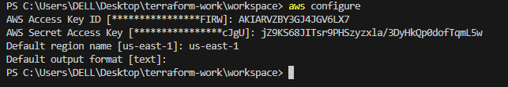

- terraform init
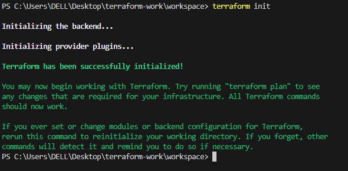

# workspace commands

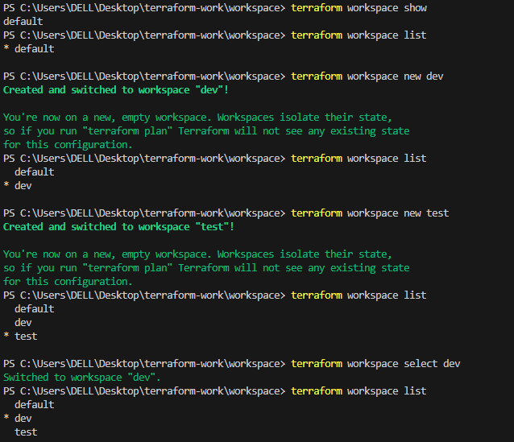 

# To create dev workspace instance on dev workspace 

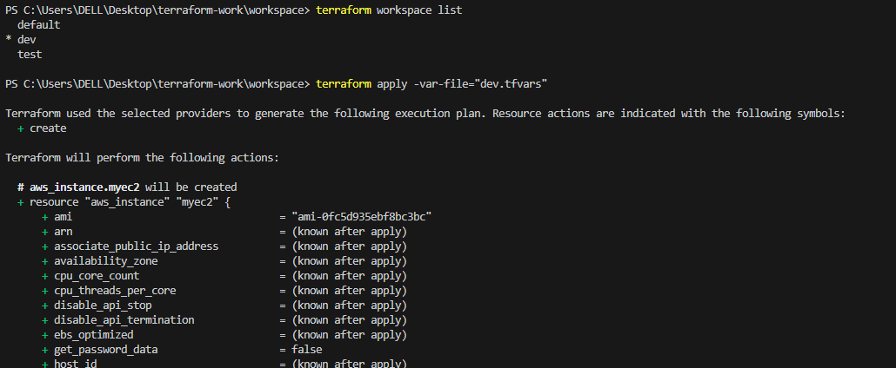

            PS C:\Users\DELL\Desktop\terraform-work\workspace> terraform apply -var-file="dev.tfvars"

            Terraform used the selected providers to generate the following execution plan. Resource actions are indicated with the following symbols:
            + create

            Terraform will perform the following actions:

            # aws_instance.myec2 will be created
            + resource "aws_instance" "myec2" {
                + ami                                  = "ami-0fc5d935ebf8bc3bc"
                + arn                                  = (known after apply)    
                + associate_public_ip_address          = (known after apply)    
                + availability_zone                    = (known after apply)
                + cpu_core_count                       = (known after apply)
                + cpu_threads_per_core                 = (known after apply)
                + disable_api_stop                     = (known after apply)
                + disable_api_termination              = (known after apply)
                + ebs_optimized                        = (known after apply)
                + get_password_data                    = false
                + host_id                              = (known after apply)
                + host_resource_group_arn              = (known after apply)
                + iam_instance_profile                 = (known after apply)
                + id                                   = (known after apply)
                + instance_initiated_shutdown_behavior = (known after apply)
                + instance_lifecycle                   = (known after apply)
                + instance_state                       = (known after apply)
                + instance_type                        = "t2.micro"
                + ipv6_address_count                   = (known after apply)
                + ipv6_addresses                       = (known after apply)
                + key_name                             = (known after apply)
                + monitoring                           = (known after apply)
                + outpost_arn                          = (known after apply)
                + password_data                        = (known after apply)
                + placement_group                      = (known after apply)
                + placement_partition_number           = (known after apply)
                + primary_network_interface_id         = (known after apply)
                + private_dns                          = (known after apply)
                + private_ip                           = (known after apply)
                + public_dns                           = (known after apply)
                + public_ip                            = (known after apply)
                + secondary_private_ips                = (known after apply)
                + security_groups                      = (known after apply)
                + source_dest_check                    = true
                + spot_instance_request_id             = (known after apply)
                + subnet_id                            = (known after apply)
                + tags                                 = {
                    + "Name" = "dev-instance"
                    }
                + tags_all                             = {
                    + "Name" = "dev-instance"
                    }
                + tenancy                              = (known after apply)
                + user_data                            = (known after apply)
                + user_data_base64                     = (known after apply)
                + user_data_replace_on_change          = false
                + vpc_security_group_ids               = (known after apply)
                }

            Plan: 1 to add, 0 to change, 0 to destroy.

            Do you want to perform these actions in workspace "dev"?
            Terraform will perform the actions described above.
            Only 'yes' will be accepted to approve.

            Enter a value: yes

            aws_instance.myec2: Creating...
            aws_instance.myec2: Still creating... [10s elapsed]
            aws_instance.myec2: Still creating... [20s elapsed]
            aws_instance.myec2: Still creating... [30s elapsed]
            aws_instance.myec2: Creation complete after 37s [id=i-076b414adb8b7d9c3]

            Apply complete! Resources: 1 added, 0 changed, 0 destroyed.
            PS C:\Users\DELL\Desktop\terraform-work\workspace> 

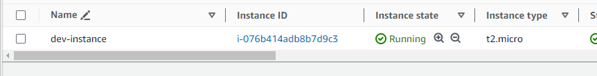

# Now switch to test workspace 

        $ terraform workspace select test 
    
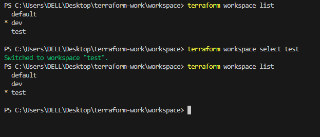

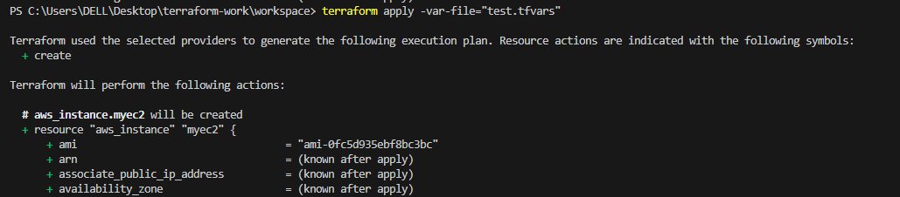

            PS C:\Users\DELL\Desktop\terraform-work\workspace> terraform apply -var-file="test.tfvars"    

            Terraform used the selected providers to generate the following execution plan. Resource actions are indicated with the following symbols:
            + create

            Terraform will perform the following actions:

            # aws_instance.myec2 will be created
            + resource "aws_instance" "myec2" {
                + ami                                  = "ami-0fc5d935ebf8bc3bc"
                + arn                                  = (known after apply)    
                + associate_public_ip_address          = (known after apply)    
                + availability_zone                    = (known after apply)    
                + cpu_core_count                       = (known after apply)    
                + cpu_threads_per_core                 = (known after apply)    
                + disable_api_stop                     = (known after apply)    
                + disable_api_termination              = (known after apply)    
                + ebs_optimized                        = (known after apply)    
                + get_password_data                    = false
                + host_id                              = (known after apply)    
                + host_resource_group_arn              = (known after apply)    
                + iam_instance_profile                 = (known after apply)    
                + id                                   = (known after apply)    
                + instance_initiated_shutdown_behavior = (known after apply)    
                + instance_lifecycle                   = (known after apply)    
                + instance_state                       = (known after apply)    
                + instance_type                        = "t2.micro"
                + ipv6_address_count                   = (known after apply)    
                + ipv6_addresses                       = (known after apply)    
                + key_name                             = (known after apply)    
                + monitoring                           = (known after apply)    
                + outpost_arn                          = (known after apply)    
                + password_data                        = (known after apply)    
                + placement_group                      = (known after apply)
                + placement_partition_number           = (known after apply)
                + primary_network_interface_id         = (known after apply)
                + private_dns                          = (known after apply)
                + private_ip                           = (known after apply)
                + public_dns                           = (known after apply)
                + public_ip                            = (known after apply)
                + secondary_private_ips                = (known after apply)
                + security_groups                      = (known after apply)
                + source_dest_check                    = true
                + spot_instance_request_id             = (known after apply)
                + subnet_id                            = (known after apply)
                + tags                                 = {
                    + "Name" = "test-instance"
                    }
                + tags_all                             = {
                    + "Name" = "test-instance"
                    }
                + tenancy                              = (known after apply)
                + user_data                            = (known after apply)
                + user_data_base64                     = (known after apply)
                + user_data_replace_on_change          = false
                + vpc_security_group_ids               = (known after apply)
                }

            Plan: 1 to add, 0 to change, 0 to destroy.

            Do you want to perform these actions in workspace "test"?
            Terraform will perform the actions described above.
            Only 'yes' will be accepted to approve.

            Enter a value: yes

            aws_instance.myec2: Creating...
            aws_instance.myec2: Still creating... [10s elapsed]
            aws_instance.myec2: Still creating... [20s elapsed]
            aws_instance.myec2: Still creating... [30s elapsed]
            aws_instance.myec2: Creation complete after 38s [id=i-0a0bcb9d7f946d794]

            Apply complete! Resources: 1 added, 0 changed, 0 destroyed.
            PS C:\Users\DELL\Desktop\terraform-work\workspace> 

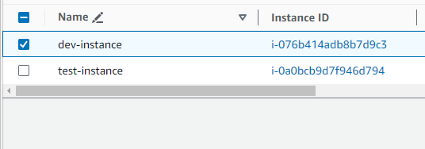

# Now destroying instances 

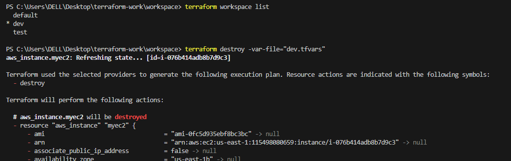

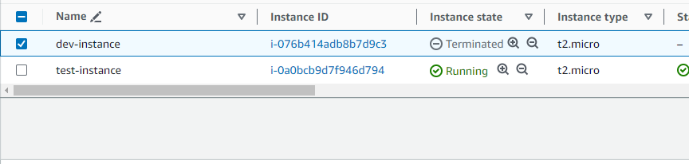

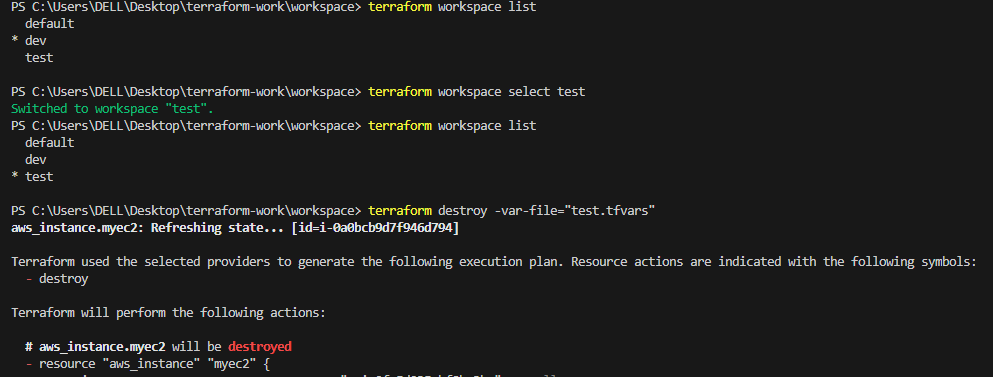

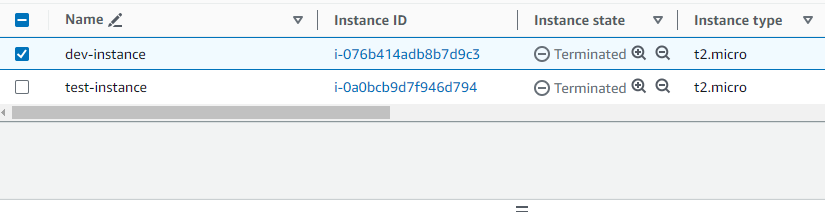